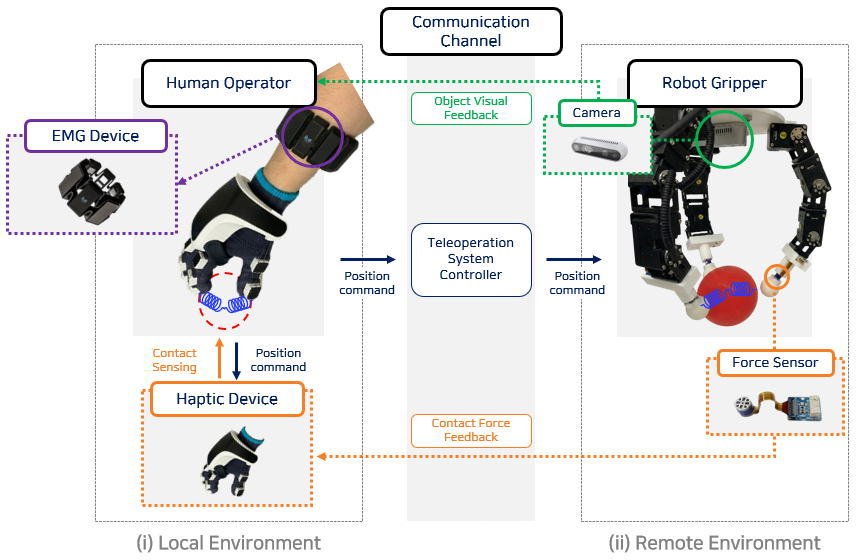
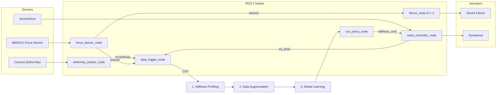
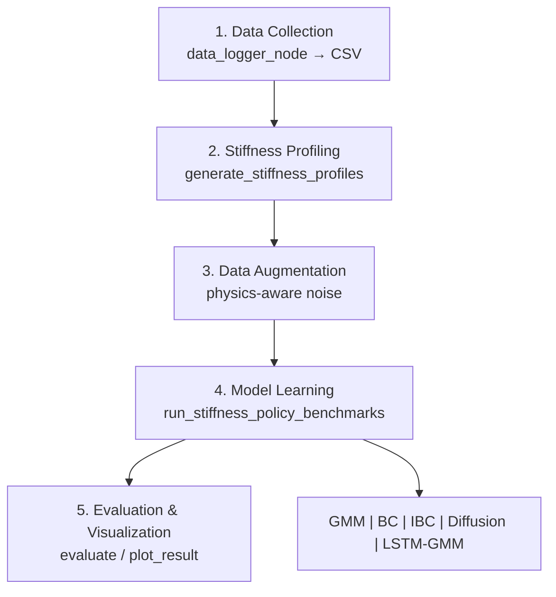

# HRI Falcon Robot Bridge

**Human-Robot Interaction Stiffness Policy Learning for Dexterous Manipulation**

ROS 2 Humble 기반의 햅틱 로봇 제어 및 강성(Stiffness) 정책 학습 프레임워크입니다. Force 센서, Falcon 햅틱 장치, Dynamixel 모터를 연동하여 인간 시연 데이터로부터 물체별 강성 정책을 학습하고 배포합니다.

---

## Demo

<table>
<tr>
<td align="center"><b>데이터 수집 (컴퓨터 화면)</b></td>
<td align="center"><b>데이터 수집 (실제 장면)</b></td>
</tr>
<tr>
<td>

<!-- TODO: 데이터 수집 시 컴퓨터 화면 영상 URL -->
https://github.com/user-attachments/assets/PLACEHOLDER_DATA_COLLECTION_SCREEN

</td>
<td>

<!-- TODO: 데이터 수집 시 실제 장면 영상 URL -->
https://github.com/user-attachments/assets/PLACEHOLDER_DATA_COLLECTION_SCENE

</td>
</tr>
<tr>
<td align="center"><b>정책 수행 (컴퓨터 화면)</b></td>
<td align="center"><b>정책 수행 (실제 장면)</b></td>
</tr>
<tr>
<td>

<!-- TODO: 실제 수행 시 컴퓨터 화면 영상 URL -->
https://github.com/user-attachments/assets/PLACEHOLDER_DEPLOYMENT_SCREEN

</td>
<td>

<!-- TODO: 실제 수행 시 실제 장면 영상 URL -->
https://github.com/user-attachments/assets/PLACEHOLDER_DEPLOYMENT_SCENE

</td>
</tr>
</table>

---

## System Architecture





---

## Experiment Progress

### 실험 대상 물체

| 물체 | 상태 | 시연 수 | 비고 |
|------|------|---------|------|
| 🎈 **풍선 (Balloon)** | ✅ 완료 | 10회 (+ 증강 데이터) | 모델 학습 및 평가 완료 |

### 풍선 실험 결과 요약

- **시연 데이터**: 10회 성공 시연 (2025.11.22 수집)
- **강성 프로파일**: Sign-aligned Global T_K 기반 생성 완료
- **학습 모델**: BC, Diffusion Policy (seq16_h2), LSTM-GMM, IBC, GMR
- **평가 지표**: Pearson 상관계수, R², RMSE
- **결과 시각화**: 6종 논문용 Figure 생성 완료

---

## Installation

### Prerequisites

- Ubuntu 22.04
- ROS 2 Humble
- Python 3.10+
- CUDA 11.8+ (GPU 학습 시)

### Conda Environment

본 프로젝트는 `icra_2025_1` conda 환경을 사용합니다. 레포에 포함된 `environment.yml`로 동일 환경을 재현할 수 있습니다.

```bash
# 환경 생성 (최초 1회)
conda env create -f environment.yml

# 환경 활성화
conda activate icra_2025_1
```

> 환경 업데이트: `conda env update -f environment.yml --prune`

### Build

```bash
# Clone repository
cd ~/ros2_ws/src
git clone https://github.com/songwookim/icra_2025_09.git hri_falcon_robot_bridge

# Install ROS dependencies
cd ~/ros2_ws
rosdep install --from-paths src --ignore-src -r -y

# Build
source /opt/ros/humble/setup.bash
conda activate icra_2025_1
colcon build --packages-select hri_falcon_robot_bridge
source install/setup.bash
```

---

## Package Structure

```
hri_falcon_robot_bridge/
├── hri_falcon_robot_bridge/          # Python ROS 2 노드들
│   ├── data_logger_node.py           # 시연 데이터 로깅
│   ├── deformity_tracker_node.py     # 변형도 추적 (eccentricity)
│   ├── force_sensor_node.py          # Force 센서 인터페이스
│   ├── robot_controller_node.py      # 로봇 제어 (Impedance)
│   ├── run_policy_node.py            # 학습된 정책 실행
│   └── ...
│
├── src/                              # C++ 노드들
│   ├── falcon_node.cpp               # Falcon 햅틱 장치 드라이버
│   └── sense_glove_node.cpp          # SenseGlove 인터페이스
│
├── scripts/                          # 파이프라인 스크립트
│   ├── 1_stiffness_profiling/        # 강성 프로파일 생성
│   ├── 2_data_augmentation/          # 데이터 증강
│   ├── 3_model_learning/             # 모델 학습 & 평가
│   ├── 4_policy_depolyer/            # 정책 배포
│   ├── 5_plot_result/                # 결과 시각화
│   ├── analysis/                     # 추가 분석 스크립트
│   └── legacy/                       # 레거시 코드 (DMP 등)
│
├── launch/                           # ROS 2 Launch 파일
├── resource/                         # 설정 파일
│   ├── robot_parameter/config.yaml   # Dynamixel 설정
│   └── sensor_parameter/config.yaml  # Force 센서 설정
├── readme_resources/                 # README 이미지
├── environment.yml                   # Conda 환경 파일
└── outputs/                          # 출력 데이터 (.gitignore)
```

---

## Resource Parameters

### `resource/robot_parameter/config.yaml`

Dynamixel 모터 및 로봇 컨트롤러 설정.

| Parameter | Default | 설명 |
|-----------|---------|------|
| `input_source` | `"hand"` | 입력 소스 (`"hand"` \| `"falcon"`) |
| `test_mode` | `true` | 테스트 모드 (dry-run) |
| `arm` | `false` | 팔 사용 여부 |
| `dynamixel.ids` | `[10,11,12,20,21,22,30,31,32]` | 사용할 Dynamixel ID 리스트 (3-finger × 3-joint) |
| `dynamixel.device_name` | `"/dev/ttyUSB0"` | USB 시리얼 포트 |
| `dynamixel.baudrate` | `1000000` | 통신 속도 |
| `dynamixel.initial_positions` | `[1365,1728,1707,...]` | 초기 관절 위치 (0‒4095) |
| `dynamixel.current.max_current` | `10` | 최대 전류 제한 |

### `resource/sensor_parameter/config.yaml`

MMS101 Force 센서 설정.

| Parameter | Default | 설명 |
|-----------|---------|------|
| `mms101.dest_ip` | `"192.168.0.200"` | 센서 IP 주소 |
| `mms101.dest_port` | `1366` | 센서 포트 |
| `mms101.sensors` | `[1, 2, 3]` | 사용할 센서 번호 |
| `mms101.n_samples` | `10` | 측정 샘플 수 |
| `mms101.debug` | `false` | 디버그 모드 |

---

## Pipeline Overview

### 전체 파이프라인 (5단계)



| 단계 | 스크립트 위치 | 설명 |
|------|--------------|------|
| **1. Stiffness Profiling** | `scripts/1_stiffness_profiling/` | Force/EMG 데이터에서 강성 프로파일 추출 |
| **2. Data Augmentation** | `scripts/2_data_augmentation/` | Physics-aware 노이즈로 데이터 증강 |
| **3. Model Learning** | `scripts/3_model_learning/` | 다양한 모델 학습 (BC, Diffusion 등) |
| **4. Policy Deploy** | `scripts/4_policy_depolyer/` | 학습된 모델 실시간 배포 |
| **5. Result Analysis** | `scripts/5_plot_result/` | 결과 비교 및 시각화 |

### 지원 모델

| Model | Type | 특징 |
|-------|------|------|
| **BC** | Behavior Cloning | MLP 기반 회귀, 기본 baseline |
| **Diffusion Policy** | Generative | DDPM/DDIM, seq16_h2 최적 구성 |
| **LSTM-GMM** | Sequence | 시계열 + GMM 출력 |
| **IBC** | Energy-based | Implicit Behavior Cloning |
| **GMR** | Probabilistic | Gaussian Mixture Regression |

---

## Quick Start

### 1. 시연 데이터 수집

```bash
# ROS 2 파이프라인 실행 후 시연 녹화
ros2 launch hri_falcon_robot_bridge full_stiffness_pipeline.launch.py
# 성공 시연 CSV → outputs/logs/<object>/success/ 에 저장
```

### 2. 강성 프로파일 생성

```bash
cd ~/ros2_ws/src/hri_falcon_robot_bridge
python3 scripts/1_stiffness_profiling/generate_stiffness_profiles_global_tk_sign_aligned.py
```

### 3. 모델 학습

```bash
python3 scripts/3_model_learning/run_stiffness_policy_benchmarks.py \
  --mode unified \
  --models all \
  --bc-epochs 200 \
  --diffusion-epochs 200 \
  --augment --augment-num 1
```

### 4. 결과 시각화

```bash
python3 scripts/5_plot_result/compare_stiffness_sessions.py
```

---

## Detailed Usage

### 학습 구성 옵션

| 구성 | 설명 | 명령 옵션 |
|------|------|----------|
| **Unified + Sign-aligned** | 단일 모델 (20D→9D), Sign-aligned Global T_K ⭐ | `--mode unified` |
| **Per-Finger** | 손가락별 모델 (8D→3D) | `--mode per-finger` |

### 데이터 차원

**Observation (20D):**
- Force 센서: 9D (3 센서 × 3 축)
- End-effector 위치: 9D (3 손가락 × 3 축)
- 변형도: 2D (circumferential, eccentricity)

**Action (9D):**
- Stiffness: 9D (3 손가락 × 3 DOF: K1, K2, K3)

### 데이터 증강 옵션

```bash
python3 scripts/3_model_learning/run_stiffness_policy_benchmarks.py \
  --augment \
  --augment-num 1 \
  --augment-noise-force 0.015 \
  --augment-noise-stiffness 0.04 \
  --augment-temporal-jitter 1
```

---

## ROS 2 Nodes

### Core Nodes

| Node | Topic (Pub/Sub) | 설명 |
|------|-----------------|------|
| `force_sensor_node` | `/force_sensor/s{1,2,3}/wrench` | MMS101 센서 데이터 발행 |
| `falcon_node` | `/falcon/{position,force}` | Falcon 위치/힘 피드백 |
| `robot_controller_node` | `/joint_commands` | Dynamixel 제어 |
| `data_logger_node` | 다수 Subscribe | 시연 데이터 CSV 저장 |
| `deformity_tracker_node` | `/deformity` | 변형도 계산 |
| `run_policy_node` | `/stiffness_command` | 학습된 정책 실행 |

### Launch

```bash
# 전체 파이프라인 실행
ros2 launch hri_falcon_robot_bridge full_stiffness_pipeline.launch.py
```

---

## Miscellaneous

### ROS 2 토픽/노드 확인

```bash
ros2 topic list -t
ros2 topic echo /force_sensor/s1/wrench
ros2 node list
```

### USB 레이턴시 최적화 (Dynamixel)

USB-시리얼 연결 시 기본 레이턴시가 높아 Dynamixel 통신이 느릴 수 있습니다.

```bash
# ttyUSB0 레이턴시를 1ms로 설정
sudo sh -c 'echo 1 > /sys/bus/usb-serial/devices/ttyUSB0/latency_timer'
```

### 프로세스 강제 종료

```bash
pkill -9 -f "ros2|python3.*hri_falcon"
```

### TensorBoard

```bash
tensorboard --logdir outputs/models/balloon/policy_learning_unified/tensorboard --port 6006
```

> 포트 충돌 시 `--port 6007` 등으로 변경.

### C++ Build Notes

- `CMakeLists.txt`에서 로컬 `libnifalcon` 탐색 → 있으면 실제 장치 모드, 없으면 시뮬레이션
- RPATH 자동 설정 → `LD_LIBRARY_PATH` export 불필요

---

## License

MIT License

## Contact

- Maintainer: Songwoo Kim